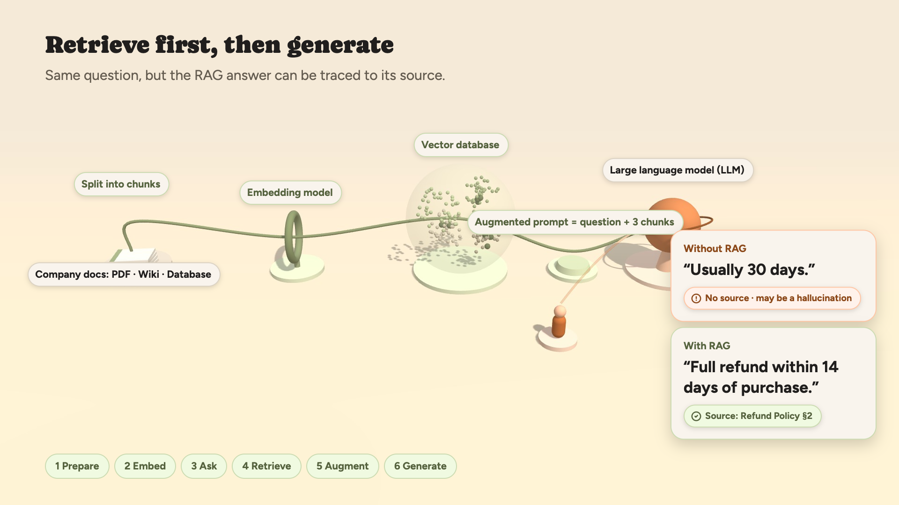
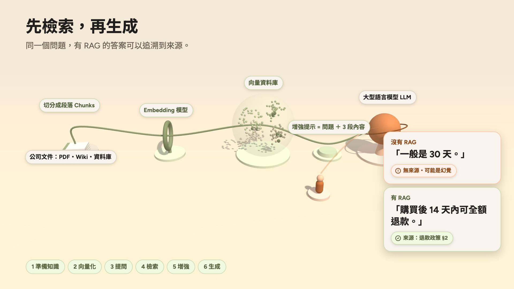

# RAG 3D Process Animation

An animated 3D walkthrough of how Retrieval-Augmented Generation (RAG) works. It follows one question through the whole pipeline and compares the answer from an LLM without RAG against the answer with RAG, which can be traced back to its source.

一個用 3D 動畫說明 RAG（檢索增強生成）運作流程的網頁，並比較有 RAG 與沒有 RAG 時 LLM 的回答差異。

## Live demo

- 繁體中文版: https://shueny.github.io/rag-explainer/
- English version: https://shueny.github.io/rag-explainer/en.html

## Screenshots

## Features

- Six steps: Prepare, Embed, Ask, Retrieve, Augment, Generate
- Side-by-side result: an answer without a source vs. an answer backed by a cited document
- Play / Pause (or press Space)
- Previous / Next section
- EN / 中文 toggle that keeps the current playback time
- Works offline: open the HTML file directly in a browser

## Tech

Each page is a single self-contained HTML file. All scripts, styles and fonts are inlined, so there is no build step and no external dependency.

## Files

- `index.html`: 繁體中文版
- `en.html`: English version
- `assets/`: screenshots used in this README
