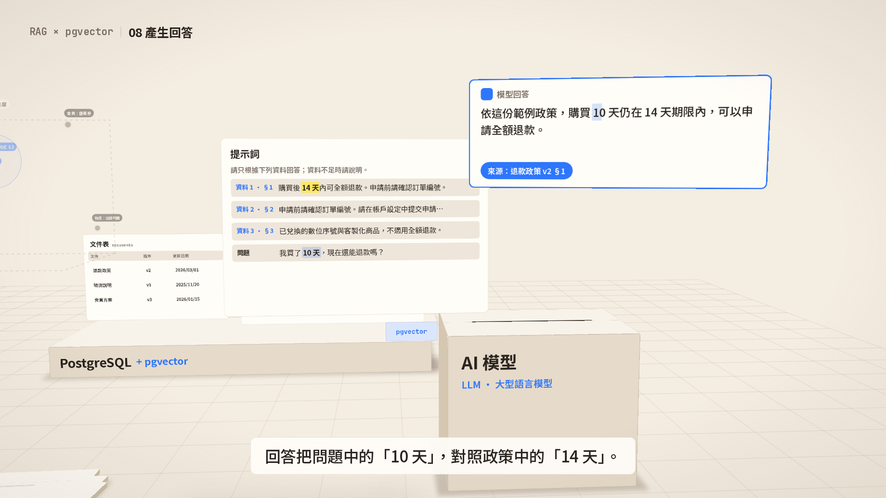

# RAG × pgvector: Animated Explainer

An animated walkthrough of Retrieval-Augmented Generation (RAG) with **PostgreSQL + pgvector** as the vector store. It follows one customer-support question, "I bought it 10 days ago. Can I still get a refund?", from chunking the company's documents to a cited answer. Along the way it shows what the embedding model, the database and the LLM each do, and where things can still go wrong.

一支說明 RAG（檢索增強生成）的動畫，以 **PostgreSQL + pgvector** 當向量資料庫。跟著一個客服問題「我 10 天前買的，還能退款嗎？」，從文件切塊一路走到附出處的回答，說明 embedding 模型、資料庫、LLM 各自負責什麼，以及哪些地方仍可能出錯。

## Live demo

- 繁體中文版: https://shueny.github.io/rag-explainer/
- English version: https://shueny.github.io/rag-explainer/en.html

## Screenshots

## Chapters (6 min 36 s)

1. Why look things up first: the same question without and with the refund policy
2. Chunking documents: split by section, keep the source, add a little overlap
3. Why search is hard: "10 days" vs "within 14 days": same topic, different words
4. Embeddings and vectors: text becomes a list of numbers; similar meaning lands close together
5. PostgreSQL and pgvector: what a chunk record stores (text, source, version, vector)
6. One query: question → vector → distance ranking → Top K
7. How pgvector helps: sources through table relations, filters by product and version, no separate vector database to sync
8. Generating the answer: prompt with sources, answer with a citation
9. Recap
10. What could go wrong: missing information, outdated documents, similar but unhelpful chunks

## Controls

- Play / Pause (or press Space), Replay
- Playback speed 0.5× – 1.5×
- Chapter menu to jump to any chapter
- **EN / 中文** button in the top bar. It keeps the current playback time.

## Tech

Built in Claude Design and exported as one self-contained HTML file per language. Scripts, styles and fonts are inlined, so there is no build step, and it also works when opened directly from disk. Values shown in the animation (vectors, distances) are illustrative.

## Files

- `index.html`: 繁體中文版
- `en.html`: English version
- `assets/`: screenshots used in this README
